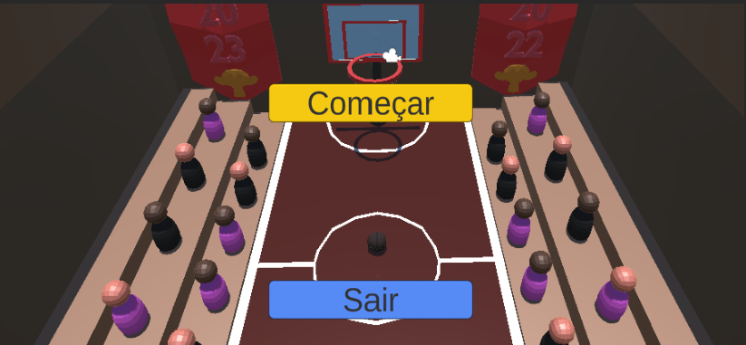
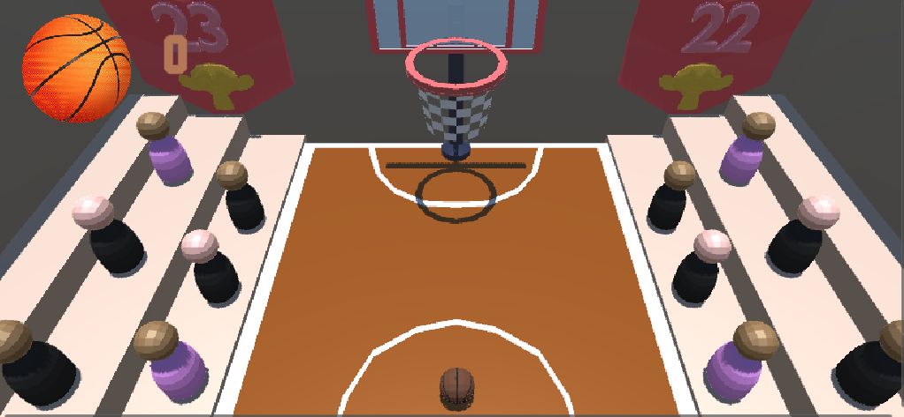
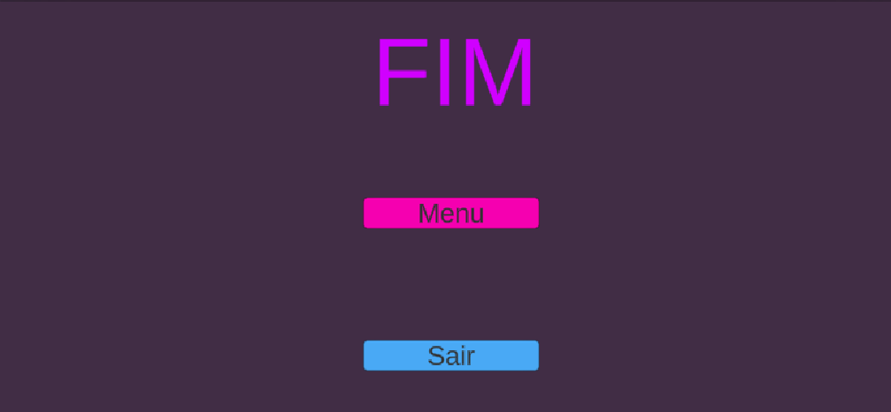
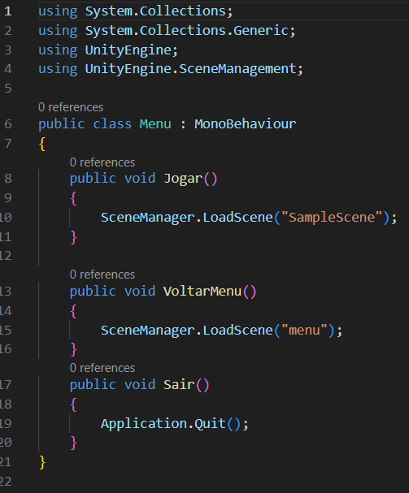
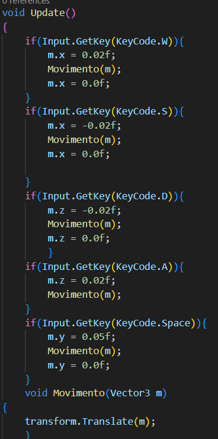

# Basquete-Unity
Carlos Alarcon e Gustavo Henrique

# links
https://drive.google.com/file/d/1F0Sp0MQeXjokMQQk9S0L_7tMIDU3lqCQ/view?usp=sharing

# Colisores
1.Static Collider 
2.Rigidbody Collider 
3.Kinematic Rigidbody Collider 
4.Static Trigger Collider 
5.Rigidbody Trigger Collider 
6.Kinematic Rigidbody Trigger Collider 
# Cenas
<h2>Essas cenas foram criadas para demonstrar os tipos de colisores do unity de um jeito divertido, simulando uma partida de basquete</h2>

<h2>O jogo consiste em acertar a cesta 2 vezes, enquanto ela se move, tornando o jogo mais dificil.
 
A cena 1 foi inteiramente montada com objetos feitos no blender, para simular um ginasio de basquete, com arquibancadas, até banners de titúlos de campeonatos.
</h2>

# Hud e Menu
  
 
 

Os menus e a hud foram feitos com o gameObject canvas, panel e buttons.
 

Este codigo define um menu com três métodos:

Jogar(): Carrega a cena "SampleScene" quando o botão "Jogar" é pressionado.
VoltarMenu(): Carrega a cena "menu" quando o botão "VoltarMenu" é pressionado.
Sair(): Encerra a aplicação quando o botão "Sair" é pressionado.

 

Este codigo contabiliza quando a bola atinge a cesta e altera o número de cestas feitas

# Script

Codígo que faz a cesta se mover: 
 
Ele utiliza uma variável de velocidade e uma posição limite em Z para mudar a direção do movimento quando o objeto ultrapassa esses limites. No método Update(), verifica-se a posição do objeto e atualiza o movimento com base na direção e na velocidade, permitindo que o objeto se mova para frente e para trás no eixo Z.
 
Codígo de movimentação utilizado na bola: 
 
O código permite mover um objeto com base nas teclas  (W, S, D, A, Espaço) que estam associadas a uma direção de movimento (frente, trás, direita, esquerda, salto). A função Movimento é chamada para aplicar o movimento ao objeto usando transform.Translate. O código redefine o vetor de movimento para zero após cada movimento, o que pode afetar a continuidade de certos movimentos, como saltos, uma vez que as componentes do vetor são zeradas.
 
Codígo para alternar a fase depois de 2 cestas: 
 
Este script controla uma contagem de colisões de um objeto com a tag "Player". Ele incrementa uma variável chamada bola cada vez que ocorre uma colisão. Quando essa variável atinge o valor de 2, o script carrega uma nova cena especificada pela variável Segfase usando SceneManager.LoadScene. Isso pode representar um sistema de contagem para passar para a próxima fase do jogo após duas colisões com este objeto.
 
Codígo para mostrar a mensagem: 

 
Este script faz com que apareça uma mensagem enquanto você está em um trigger collider.

# Static Collider
É um colisor que irá ficar estatico, ele foi utilizado na quadra, arquibancadas e paredes do ginasio, além das paredes invisíves que limitam a área de movimento da bola(jogador). 

# Rigidbody Collider
É um colisor combinado com um Rigidbody, ele foi utilizado principalmente na bola, para dar fisica à ela. 

# Kinematic Rigidbody Collider
É um colisor combinado com um rigidbody com a opção kinematic ativada para ser controlado por script, foi utilizado para a cesta. 

# Static Trigger Collider
É um colisor estatico com a opção de trigger ativado, ele foi utilizado na área onde aparece o texto. 

# Rigidbody Trigger Collider e Kinematic Rigidbody Trigger Collider
Esses são colisores combinados com rigidbody com a opção de trigger e kinematic, e eles foram utilizados no cubo que conta as cestas para passar de fase. 

